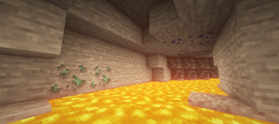

### About Mystic Gemstones

This is my first Minecraft mod, and it is currently in Alpha so don't expect much at this point.
If you like the idea of this mod keep an eye on it because I have a lot of plans for new cool features that I will be adding in the future versions.

### What has been added already?
At this point there are only few gems, some of which already have powers. Though it is not actual gems that have powers but rings and charm made from them.
 
If you have any ideas or want to help with development in any way feel free to submit ideas [here](https://github.com/MysticGemstonesMod/MysticGemstones/discussions/categories/ideas), report bugs [here](https://github.com/MysticGemstonesMod/MysticGemstones/issues) or open up a pull request.

### Links
- [Website](https://mysticgemstones.xyz/)
- [FAQs](https://mysticgemstones.xyz/index.html#FAQs)
